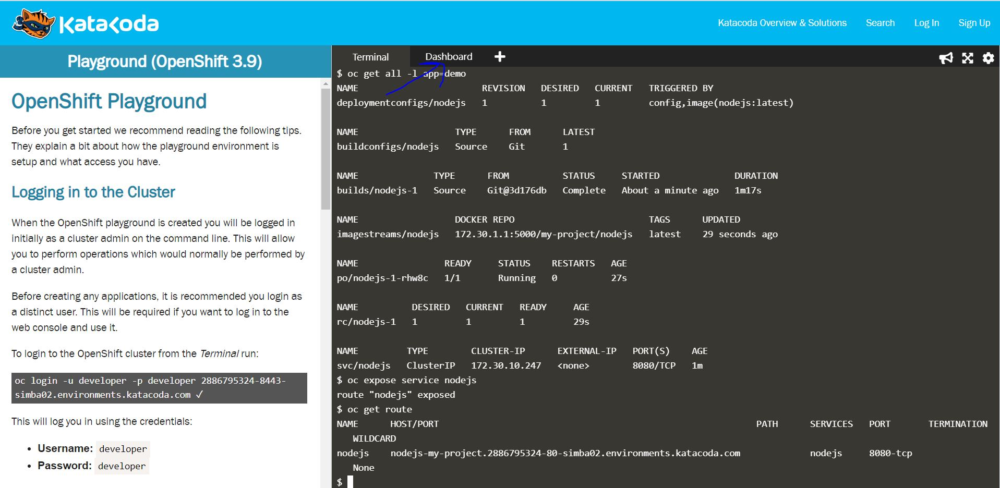
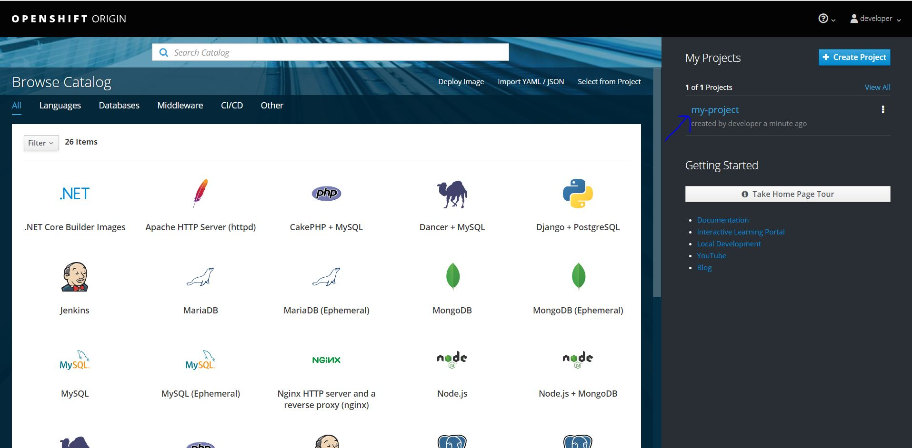
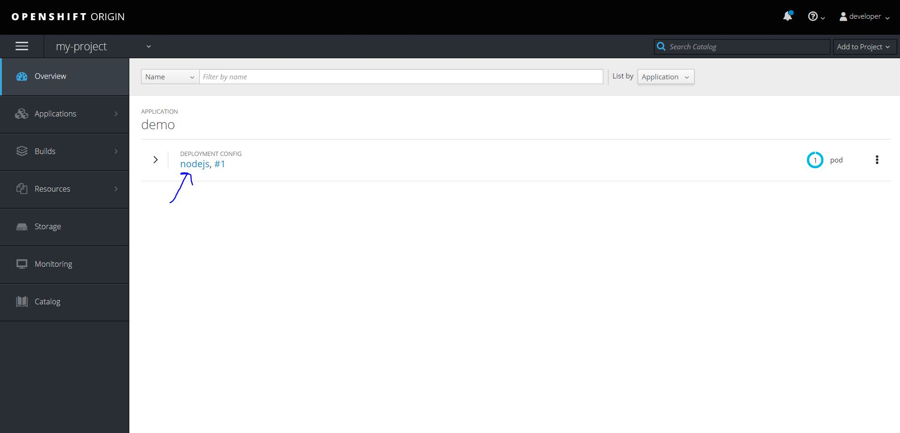
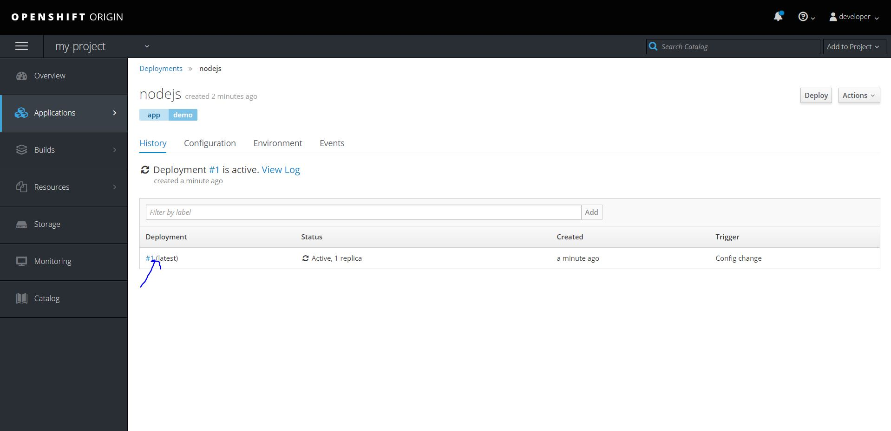
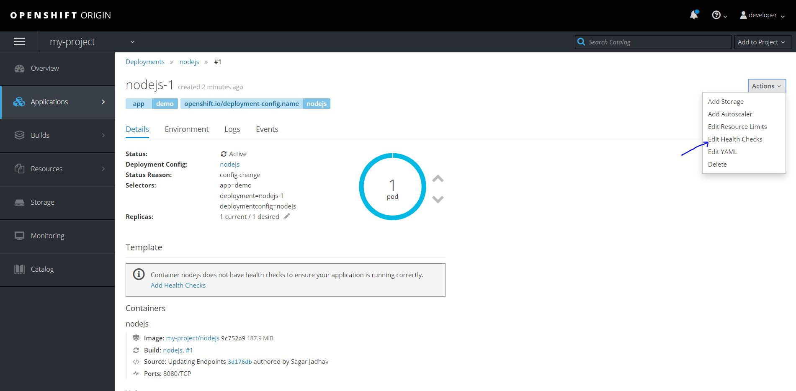
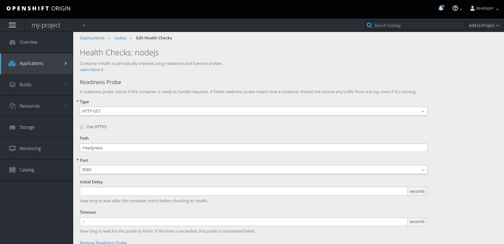
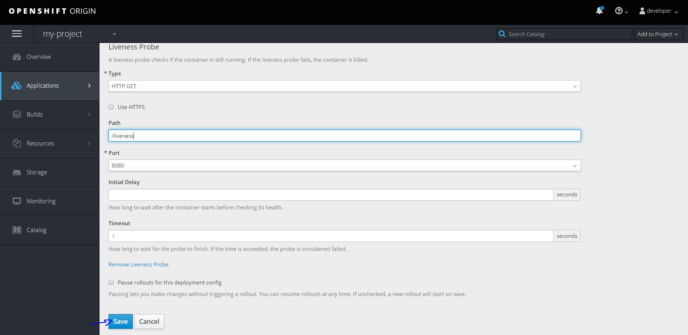

# Monitor Application with Probes

## Objective
- Add Readiness Probe to Node JS Application
- Add Liveness Probe to Node JS Application

### Step 1: Deploy nodejs application using s2i
Refer [Application Deployment using S2I](./5_application_deployment_using_S2I.md) tutorial

### Step 2: Open dashobard

### Step 3: Login with developer user

### Step 4: Go to project my-project

### Step 5: Go to application nodejs

### Step 6: Go to deployment

### Step 7: Go to health checks

### Step 8: Add readiness probe

### Step 9: Add liveness probe & save
