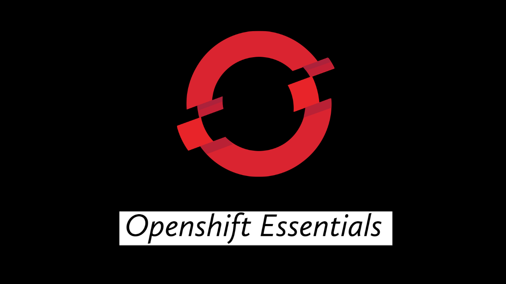

# Learn essential concepts of Openshift through basic tutorials

## Contents

- [User & Project Management](./1_user_and_project_management.md)
- [Networking](./2_networking.md)
- [Scaling an Application](./3_scaling_an_application.md)
- [Persistent Storage](./4_persistent_storage.md)
- [Application Deployment using S2I](./5_application_deployment_using_S2I.md)
- [Monitor Application with Probes](./6_monitor_application_with_probes.md)
- [Limiting Resources](./7_limiting_resource.md)
- [Application Deployment using Templates](./8_application_deployment_using_templates.md) 

## Contributing

Pull requests are welcome. I will appreciate any help on either enhancing existing tutprial or addition of new tutorial.

1. Fork the repo on GitHub
2. Clone the project to your own machine
3. Commit changes to your own branch
4. Push your work back up to your fork
5. Submit a Pull request so that we can review your changes

## Hit Star ⭐️ & Start learning !!
