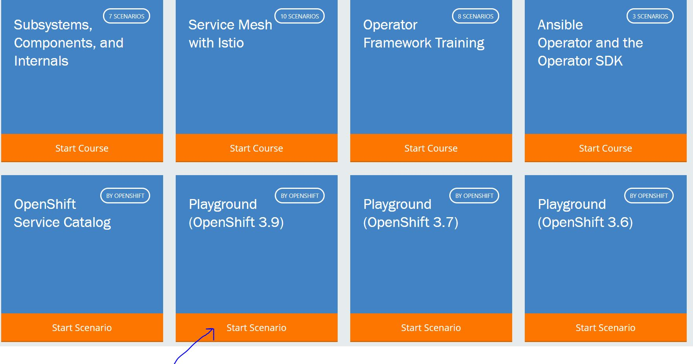

## Step 1: Go to https://katacoda.com/

## Step 2: Scroll down & click on Openshift icon

## Step 3: Click on Playground Openshift 3.9

## Step 4: Click on start scenario

## Step 5: Run example !!
